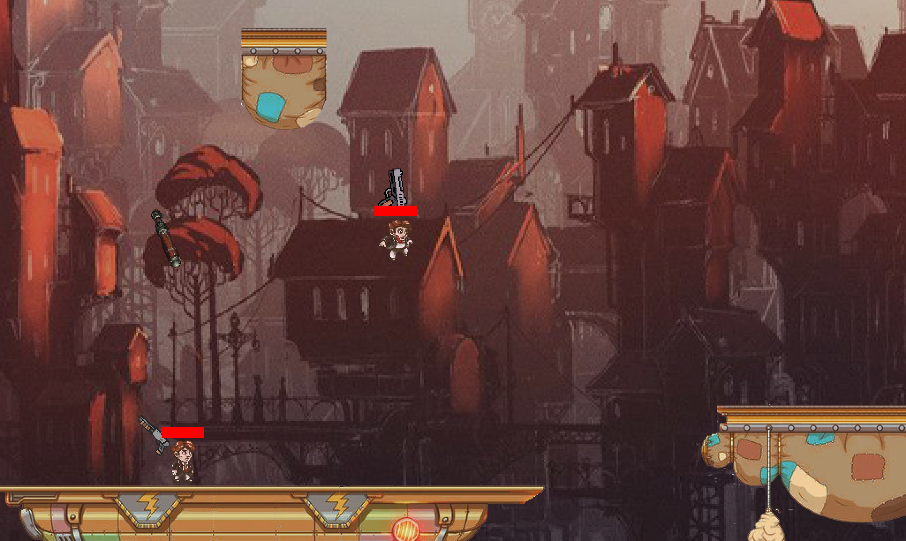

# Teeworlds


Авторы: Андрей Волков, Артём Топорков


## Как играть

В главном меню:
- *Start* - начать игру (если стоит флаг на *Multiplayer*, то подключаемся к серверу, если нет, то играем локально)
- *Level editor* - редактор уровней, интерфейс понятен
- *Exit* - ...
- *Multiplayer* - ...

Чтобы играть в мультиплеере, нужно предварительно запустить сервер server.py и нажать на соответствующую кнопку запуска (большая заметная зелёная кнопка). Также желательно не забыть у всех игроков при запуске поставить галочку на мультиплеере в меню внизу.

Итого (в разных терминалах):

```
python server.py
python main.py
python main.py
```

## Редактор

В меню есть кнопка `levels editor`, которая отвечает за редактор уровней. В нём в меню слева можно выбирать понравившиеся платформы, ставить на карту справа.

Соответственно, по кнопке `save` её можно сохранить, назначив ей какое-нибудь имя.

Впоследствии эту карту можно будет выбрать на сервере.

## Управление

- *w, a, s, d* - движение
- *left shift* - крюк для зацепа за платформы
- *ПКМ* - выстрел
- *ЛКМ* - смена вида оружия

## Оружие

Есть три вида оружия: классический пистолет, дробовик и пушка, стреляющая взрывными ракетами.
Также есть аптечка, которую можно использовать один раз за игру.

## Читы

- *sakevich* - включение хитбоксов

## Ивенты

На сервере есть возможность включить ивенты - ракеты, падающие с неба и наносящие урон игрокам.

## Тесты

Покрытие тестами: 81%.

